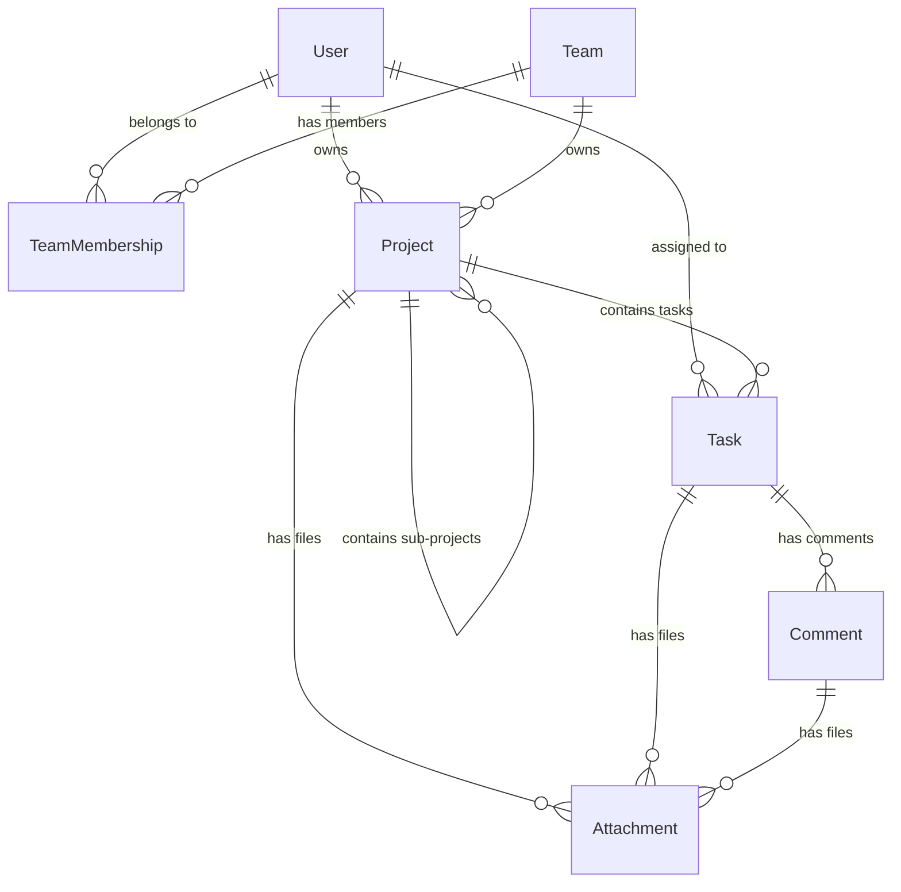

# Database Structure

## 1. Visual Overview (ER Diagram)

## 2. Core Concepts

### **Polymorphic Attachments**

Instead of creating separate database tables for project files, task files, and comment files, we use a single smart table called attachments.

It uses two special columns: `attachable_id` (the ID of the item) and `attachable_type` (e.g., "Task" or "Project").

This keeps the database clean and allows us to add file support to new features easily.

### **Recursive Projects (Folders)**

We wanted projects to behave like folders on your computer.

The projects table points to itself using a `parent_id`.

If a project has no `parent_id`, it is a Root Folder.

If it has a `parent_id`, it sits inside another project.

**Rule:** A project acts as a container. If it holds sub-projects, it cannot hold tasks.

### **User Roles & Security**

**Identity:** We use devise for secure passwords.

**Tokens:** We store a `jti` column to uniquely identify every login session. This allows us to revoke a specific token if a user logs out.

**Permissions:** We use a `TeamMembership` table to define who can do what. Just because you are a user doesn't mean you can see a team's data. You must be explicitly added to that team.
